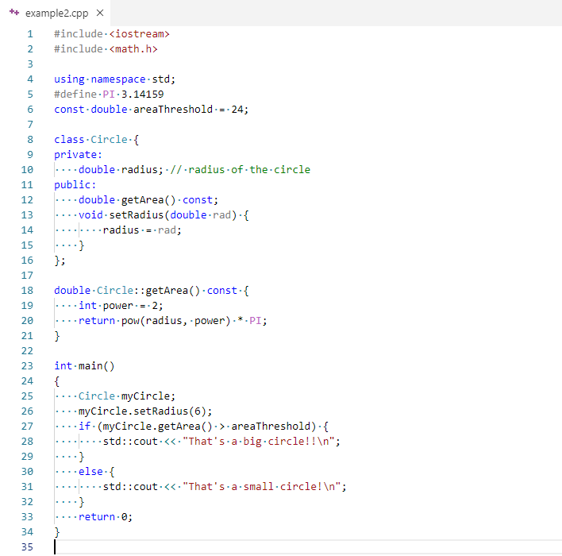
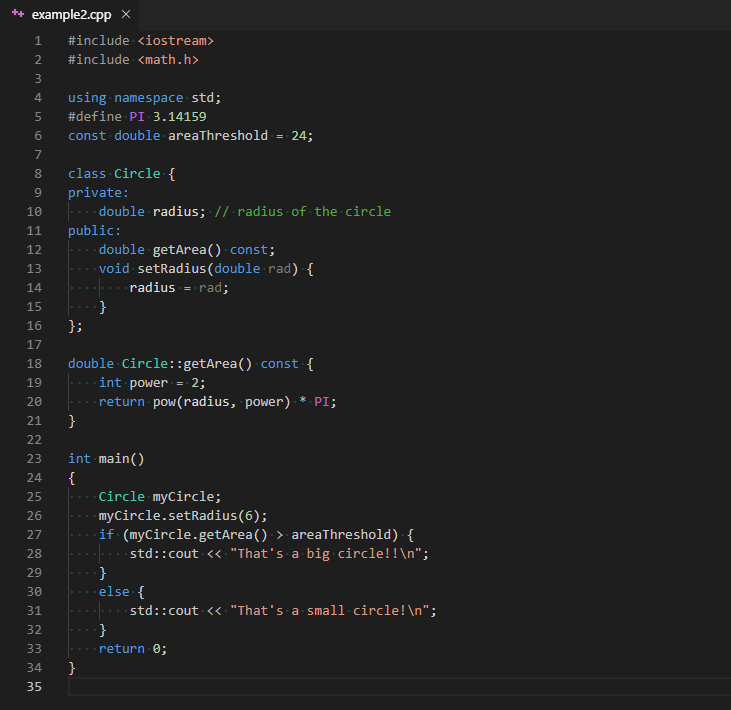

# C/C++ Extension UI Themes

[Semantic colorization was added to the C/C++ Extension 0.24.0]( https://devblogs.microsoft.com/cppblog/visual-studio-code-c-c-extension-july-2019-update/).  By default, colorization in VS Code is syntactic/lexical and leverages TextMate grammar to associate named 'scopes' with syntactic elements.  Themes and settings can be used to apply the colors associated with those scopes.  Our implementation of semantic colorization leverages the same system of associating colors with named scopes.  But, some tokens that can be colored by semantic colorization in C/C++ do not have existing anologs in VS Code's TextMate grammar.  So, new named scopes are required.  Information about these new scopes can be found [here](https://code.visualstudio.com/docs/cpp/colorization-cpp).  Because these scopes are new, existing themes do not include colors for them either.

We created C/C++ Extension UI Themes to closely match Visual Studio themes, and include colors for many of the new scopes.

## Example

Light Theme

Dark Theme

## Contributing

This project welcomes contributions and suggestions.  Most contributions require you to agree to a
Contributor License Agreement (CLA) declaring that you have the right to, and actually do, grant us
the rights to use your contribution. For details, visit https://cla.opensource.microsoft.com.

When you submit a pull request, a CLA bot will automatically determine whether you need to provide
a CLA and decorate the PR appropriately (e.g., status check, comment). Simply follow the instructions
provided by the bot. You will only need to do this once across all repos using our CLA.

This project has adopted the [Microsoft Open Source Code of Conduct](https://opensource.microsoft.com/codeofconduct/).
For more information see the [Code of Conduct FAQ](https://opensource.microsoft.com/codeofconduct/faq/) or
contact [opencode@microsoft.com](mailto:opencode@microsoft.com) with any additional questions or comments.
